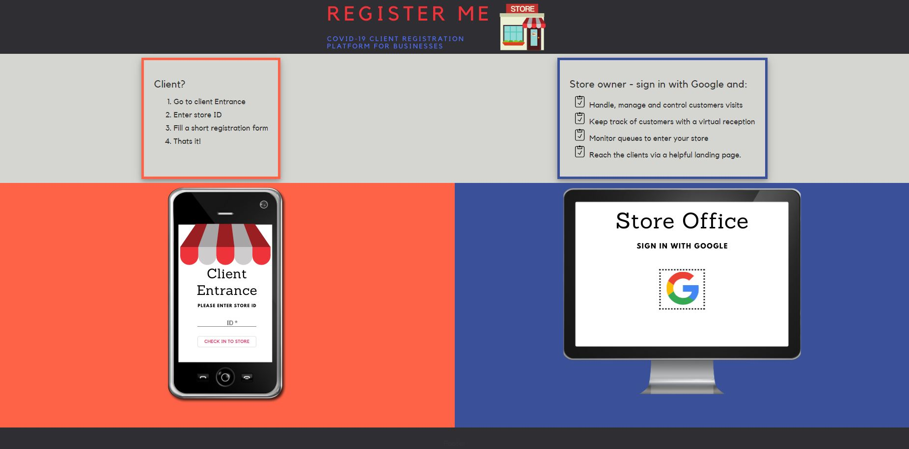

## COVID-19 client registration platform
A registration platform for businesses to handle, manage and control clients visits of physical stores.
Platform enables business owners to keep track of customers with a virtual reception, monitor queues and reach the clients via a helpful landing page.
### Screen Shot:

### Installation and Setup Instructions:
Clone down this repository. You will need [node](https:https://nodejs.org/en/) and [npm](https:https://nodejs.org/en/) installed globally on your machine. 

To install:
```bash
npm install
```
To Start Server:
```bash
npm start  
```
And then
```bash
node server.js
````
To Visit App:
[http://localhost:4200]

## About the project.
 I came up with the web app While COVID-19 quarantine in Israel was about to end.

The government released a note that all businesses need to log all the customers visit their business.
My mother's shoe store for example uses a Handwritten log that took precious time. 

The other day, while waiting to enter a store I realize the need for a digital waiting list of customers outside the store, Can help avoid arguments :) 

##### The idea is simple:
- Store owners log in with google and create a store.

- Each store gets a unique id.

- Customers register to store by store id and then fill a short registration form.

- The store owner has a dashboard with an editable log and a Track of the queue outside.

##### Built with
- [Angular](https://angular.io/start)
- [Express](https://expressjs.com/)
- [MongoDB](https://www.mongodb.com/)
- [Ignite UI for Angular](https://www.infragistics.com/products/ignite-ui-angular)
- [google-api-OAuth2](https://github.com/googleapis/google-api-nodejs-client/)
- [Flexbox](https://css-tricks.com/snippets/css/a-guide-to-flexbox)

##### The project is still in progress.


